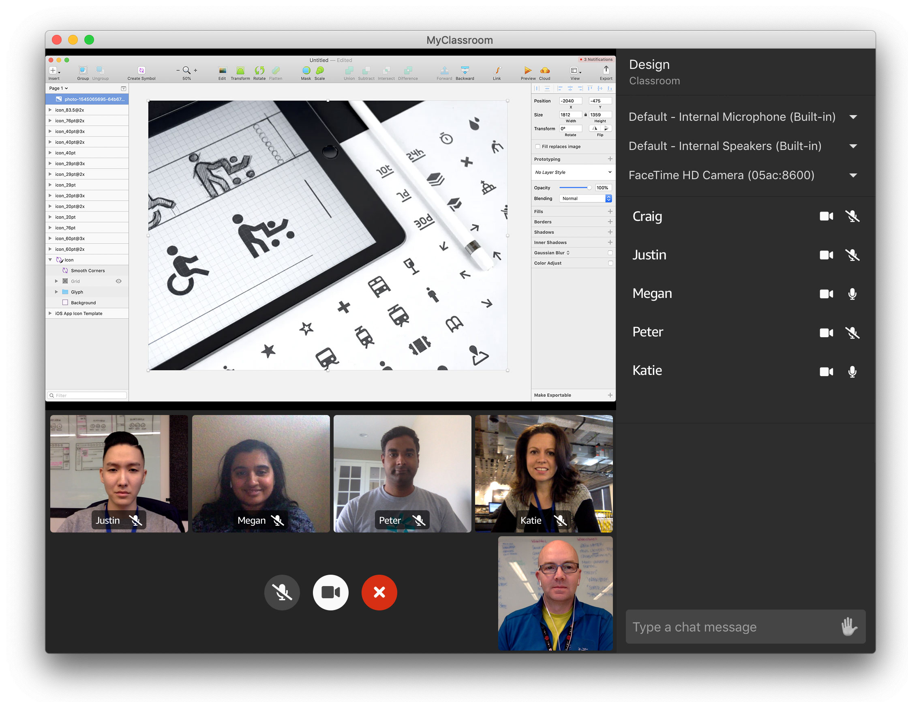

# Amazon Chime SDK Classroom Demo

This demo shows how to use the Amazon Chime SDK to build an online classroom in Electron and React.



## Installation

### Option 1: Deploy via AWS Cloud9

#### Prerequisites

- Log into your AWS account with an IAM role that has the **AdministratorAccess** policy.
- Use the **us-east-1 (N. Virginia)** region of your AWS account.

#### Create an AWS Cloud9 environment

1. Go to the [AWS Cloud9 Dashboard](https://us-east-1.console.aws.amazon.com/cloud9/home?region=us-east-1).
2. Press the **Create environment** button or go [here](https://us-east-1.console.aws.amazon.com/cloud9/home/create).
3. For the Name enter `<unique environment name>` and press the **Next step** button.
4. For **Environment Settings** use the defaults and press the **Next step** button.
5. Review the **Environment name and settings** and press the **Create environment** button.
6. Wait for the environment to start.

#### Run the deployment script

Once the Cloud9 environment starts, run the following commands in the Terminal pane at the bottom of the window to download the application repository:

```
git clone https://github.com/aws-samples/amazon-chime-sdk-classroom-demo.git
cd amazon-chime-sdk-classroom-demo
```

Now in the same Terminal pane, run the following command to deploy, package, and create a distribution for your application. Note this will take about 15 minutes.

```bash
script/deploy.js -r <region> -a <app name> -s <unique stack name> -b <unique bucket name>
```

At the end of the script you will see a URL to a download page. Save this link.

### Option 2: Deploy from your local machine

#### Prerequisites
To deploy the classroom demo you will need:

- Node 10 or higher
- npm 6.11 or higher

And install aws and sam command line tools:

* [Install the AWS CLI](https://docs.aws.amazon.com/cli/latest/userguide/install-cliv1.html)
* [Install the AWS SAM CLI](https://docs.aws.amazon.com/serverless-application-model/latest/developerguide/serverless-sam-cli-install.html)

First deploy the stack:

```bash
script/deploy.js -r <region> -a <app name> -s <unique stack name> -b <unique bucket name>
```

At the end of the script you will see a URL to a download page. Save this link. To run the application locally in Electron run:

```bash
yarn dev
```

Before pushing your commit, ensure that the application works okay in production mode.

```bash
yarn cross-env DEBUG_PROD=true yarn start
```

## Troubleshooting

### I get "The application ... can't be opened" when opening the app

The default zipping tool on MacOS Catalina may incorrectly unzip the package. Download an alternative (such as "The Unarchiver"), and unzip the package by right clicking and selecting "Open as". You may also need to adjust your security & privacy settings if you get an "unidentified developer" message.